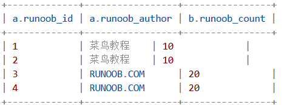
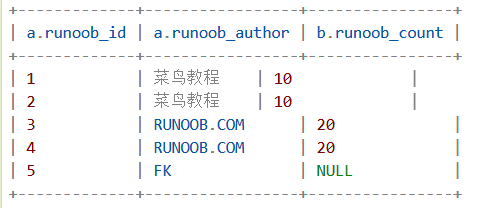
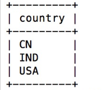
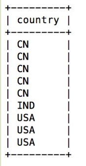
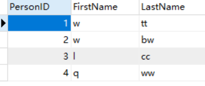
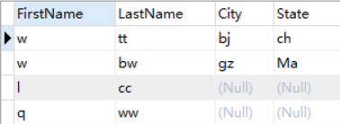
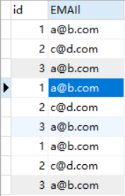
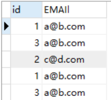

# MySQL 基础 （三）- 表联结

## 学习内容

1. MySQL别名

   为表取别名：当表的名字很长或者执行一些特殊查询时，为了方便操作或者需要多次使用相同的表时，可以为表指定别名，以替代表原来的名称。

   ##### **表名   [AS]   表别名**

   ```mysql
   SELECT o.city, o.phone FROM offices AS o;
   ```

   为字段取别名：SELECT  语句显示查询结果时，MySQL 会显示每个  SELECT  后面指定的输出列，在有些情况下，显示的列的名称会很长或者名称不够直观，这时可以指定列别名。

   #####  列名    [AS]    列别名

   ```mysql
   SELECT city AS co FROM offices;
   ```

2. INNER JOIN

   真正的应用中经常需要从多个数据表中读取数据。

   本章节我们将向大家介绍如何使用 MySQL 的 JOIN 在两个或多个表中查询数据。

   你可以在 SELECT, UPDATE 和 DELETE 语句中使用 Mysql 的 JOIN 来联合多表查询。

   **INNER JOIN（内连接,或等值连接）**：获取两个表中字段匹配关系的记录。

   ```mysql
   SELECT a.runoob_id, a.runoob_auther, b.runoob_count FROM runoob a INNER JOIN tcount_tb1 b ON a.runoob_auther = b.runoob_auther;
   ```

   

   等值连接，当a、b存在设定相同的时候导出

3. LEFT JOIN/RIGHT JOIN

   LEFT JOIN 会读取左边数据表的全部数据，即便右边表无对应数据

   RIGHT JOIN同理

   ```MYSQL
   SELECT a.runoob_id, a.runoob_auther, b.runoob_count FROM runoob_tb1 a LEFT JOIN tcount_tb1 b ON a.runoob_auther = b.runoob_auther
   ```

   

   LEFT  JOIN， 左边的数据表完全都读取出来，将存在对应ON后条件相同的输出，如果没有就输出NULL

4. CROSS JOIN

   cross join：交叉连接，得到的结果是两个表的乘积把表A和表B的数据进行一个N*M的组合，即[笛卡尔积]

   ```mysql
   select * from A cross join B;
   ```

   Full join:全连接产生的所有记录（双方匹配记录）在表A和表B。如果没有匹配,则对面将包含null，指产生A和B的并集。对于没有匹配的记录，则会以null做为值。

5. 自连接

   本质是把一张表当成两张表来使用。

   mysql有时在信息查询时需要进行对自身连接（自连接），所以我们需要为表定义别名

   ```mysql
   SELECT a.ename '备注aname', b.ename '备注bname' FROM emp a LEFT JOIN emp b ON a.leaderid = b.eid;
   ```

6. UNION

   MySQL UNION 操作符用于连接两个以上的 SELECT 语句的结果组合到一个结果集合中。多个 SELECT 语句会删除重复的数据。

   ```mysql
   SELECT expression1, expression2, ... expression_n
   FROM tables
   [WHERE conditions]
   UNION [ALL | DISTINCT]
   SELECT expression1, expression2, ... expression_n
   FROM tables
   [WHERE conditions];
   ```

   示例：

   ```mysql
   SELECT country FROM Websites 
   UNION
   SELECT country FROM apps
   ORDER BY country;
   ```

   

   UNION 不能用于列出两个表中所有的country。如果一些网站和APP来自同一个国家，每个国家只会列出一次。UNION 只会选取不同的值

   ```mysql
   SELECT country FROM Websites
   UNION ALL
   SELECT country FROM apps
   ORDER BY country;
   ```

   

   选取**所有的**country（也有重复的值）

7. 以上几种方式的区别和联系

* INNER JOIN:全连接，求交集，链接字段相等
* LEFT JOIN：左连接，返回左表中所有记录和右表字段相等的记录
* CROSS JOIN：表A和表B的数据进行一个N*M的组合
* 自连接：本质是把一张表当成两张表来使用
* UNION：用于连接两个以上的 SELECT 语句的结果组合到一个结果集合中。

## 作业

### 项目五：组合两张表 （难度：简单）

在数据库中创建表1和表2，并各插入三行数据（自己造）
表1: Person
+-------------+---------+
| 列名         | 类型     |
+-------------+---------+
| PersonId    | int     |
| FirstName   | varchar |
| LastName    | varchar |
+-------------+---------+
PersonId 是上表主键
表2: Address
+-------------+---------+
| 列名         | 类型    |
+-------------+---------+
| AddressId   | int     |
| PersonId    | int     |
| City        | varchar |
| State       | varchar |
+-------------+---------+
AddressId 是上表主键
编写一个 SQL 查询，满足条件：无论 person 是否有地址信息，都需要基于上述两表提供 person 的以下信息：FirstName, LastName, City, State

创建表格

```mysql
CREATE TABLE Person(
   PersonId INT UNSIGNED AUTO_INCREMENT,
   FirstName VARCHAR(100) NOT NULL,
   LastName  VARCHAR(100) NOT NULL,
   PRIMARY KEY (PersonId)
);

CREATE TABLE Address(
	AddressId INT UNSIGNED,
  PersonId INT UNSIGNED,
  City VARCHAR(100) NOT NULL,
  State  VARCHAR(100) NOT NULL,
  PRIMARY KEY (AddressId)
)

```

插入数据

```mysql
INSERT INTO person
	(FirstName, LastName)
	VALUES
	('w', 'tt'),
	('w', 'bw'),
	('l', 'cc'),
	('q', 'ww');
INSERT INTO address
	(AddressID, PersonID, City, State)
	VALUES
	(12, 1, 'bj', 'ch'),
	(23, 2, 'gz', 'Ma'),
	(11, 5, 'sh', 'AF');	
```




查询语句

```mysql
   SELECT p.FirstName, p.LastName, a.City, a.State 
     FROM person p 
LEFT JOIN address a 
       ON p.PersonID = a.PersonID
```

 

### 项目六：删除重复的邮箱（难度：简单）

编写一个 SQL 查询，来删除 email 表中所有重复的电子邮箱，重复的邮箱里只保留 Id 最小 的那个。
+----+---------+
| Id | Email   |
+----+---------+
| 1  | a@b.com |
| 2  | c@d.com |
| 3  | a@b.com |
+----+---------+
Id 是这个表的主键。
例如，在运行你的查询语句之后，上面的 Email表应返回以下几行:
+----+------------------+
| Id | Email            |
+----+------------------+
| 1  | a@b.com |
| 2  | c@d.com  |
+----+------------------+

查询重复数据

```mysql
SELECT id 
  FROM testemail 
 WHERE EMAIL in (
	SELECT EMAIL 
    FROM testemail
GROUP BY EMAIL 
  HAVING COUNT(EMAIL) > 1)
```

查询最小id

```mysql
SELECT min(id)
  FROM testemail
 WHERE id IN (SELECT id 
  FROM testemail 
 WHERE EMAIL = (
	SELECT EMAIL 
    FROM testemail
GROUP BY EMAIL 
  HAVING COUNT(EMAIL) > 1))
```

查询id在重复数据范围内但是不属于最小id的数据

```mysql
SELECT * 
FROM testemail
WHERE id in 
(SELECT id 
  FROM testemail 
 WHERE EMAIL in (
	SELECT EMAIL 
    FROM testemail
GROUP BY EMAIL 
  HAVING COUNT(EMAIL) > 1))
and id not in 
(SELECT min(id)
  FROM testemail
 WHERE id IN (SELECT id 
  FROM testemail 
 WHERE EMAIL = (
	SELECT EMAIL 
    FROM testemail
GROUP BY EMAIL 
  HAVING COUNT(EMAIL) > 1)))
```

总结

创建临时表

```MYSQL
CREATE TABLE tempemail AS (SELECT * FROM email)

DELETE FROM email
WHERE id in 
(SELECT id 
  FROM tempemail 
 WHERE EMAIL in (
	SELECT EMAIL 
    FROM tempemail
GROUP BY EMAIL 
  HAVING COUNT(EMAIL) > 1))
and id not in 
(SELECT min(id)
  FROM tempemail
 WHERE id IN (SELECT id 
  FROM tempemail 
 WHERE EMAIL = (
	SELECT EMAIL 
    FROM tempemail
GROUP BY EMAIL 
  HAVING COUNT(EMAIL) > 1)))
  
DROP TABLE tempemail;
```

**非创建临时表的方法**

设定两个表别名，设定，在两个表相同的email连接起来

```mysql
SELECT e1.id, e1.EMAIl
FROM testemail as e1, testemail as e2
```



```mysql
SELECT e1.id, e1.EMAIl
FROM testemail as e1, testemail as e2
WHERE e1.EMAIL = e2.EMAIL
```




```mysql
SELECT e1.id, e1.EMAIl
FROM testemail as e1, testemail as e2
WHERE e1.EMAIL = e2.EMAIL
AND e1.id != e2.id;
```


```mysql
SELECT e1.id, e1.EMAIl
FROM testemail as e1, testemail as e2
WHERE e1.EMAIL = e2.EMAIL
AND e1.id > e2.id;
```


运用自连接的方法